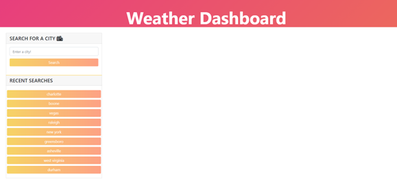
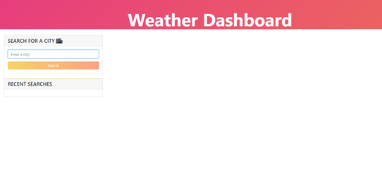
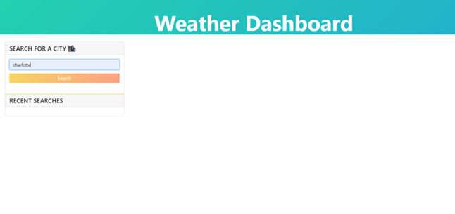

# weather-dashboard


## User Story 
```
AS A traveler
I WANT to see the weather outlook for multiple cities
SO THAT I can plan a trip accordingly
```


## Acceptance Criteria 
```
GIVEN a weather dashboard with form inputs
WHEN I search for a city
THEN I am presented with current and future conditions for that city and that city is added to the search history
WHEN I view current weather conditions for that city
THEN I am presented with the city name, the date, an icon representation of weather conditions, the temperature, the humidity, the wind speed, and the UV index
WHEN I view the UV index
THEN I am presented with a color that indicates whether the conditions are favorable, moderate, or severe
WHEN I view future weather conditions for that city
THEN I am presented with a 5-day forecast that displays the date, an icon representation of weather conditions, the temperature, the wind speed, and the humidity
WHEN I click on a city in the search history
THEN I am again presented with current and future conditions for that city
```


## Consist Of 
```
* Bootstrap, Font Awesome, jQuery, Moment.js, JavaScript, CSS, HTML

* Loops, if statements 

* Callbacks, event Listeners

* return statements 

* eventDefault methods

* Semantics and logical statements 

* Template Literals

* Fetch methods 

*APIs and apikeys 

```


## Important Links 

* GitHub Link: https://github.com/MichaelZimm20/weather-dashboard

* Deployable Live Link: https://michaelzimm20.github.io/weather-dashboard/


## Screenshots

 
<br/><br/><br/><br/><br/>


<br/><br/><br/><br/>

 
<br/><br/><br/><br/>

 
<br/><br/><br/><br/>


credit: w3schools.com for background-img help and button background img
https://www.w3schools.com/css/css3_gradients.asp

for button gradient:
https://codepen.io/pirrera/pen/bqVeGx


jumobotron background animation:
https://www.sliderrevolution.com/resources/css-animated-background/
